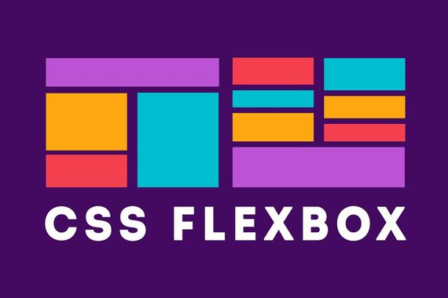

# Flexbox Layout Module

September 2020

\> 🔨 Flexbox. From Undemy '[Flexbox CSS - Le guide complet par la pratique](https://www.udemy.com/course/guide-complet-flexbox/)'

\* * *



## Flex

Before we used that kind of solutions to display elements:


Or usual boxes models: display; inline, inline-block

New model: `display: flex`. It's an easy way to divide and position children elements. It's possible to modify order: asc, desc etc...


## Container

Flex is a container that content children called items.

Container ('flex container') = Parent

Items ('flex items') = Children

````scss
.container{
  display: flex;
}
````

````html
<div class="container">
  <div class="item">1</div>
  <div class="item">2</div>
  <div class="item">3</div>
  <div class="item">4</div>
</div>
````


### Prefixes

If you don't use css postprocessor, you maybe will have to add prefixes with some browsers

````CSS
.container{
    display: -webkit-box; 
    display: -moz-box;
    display: -ms-flexbox;
    display: -webkit-flex; 
    display: flex;
}
````

### flex-direction

 `display: flex` main declaration.

`flex-direction` defines **main axi**s and **distribution wa**y, default is `flex-direction: row` (default left to right).

````scss
.container{
  display: flex;
  flex-direction: row;
}
````


`flex-direction: row-reverse`, will change the distribution way.


`flex-direction: column`, to change main axis to vertical axis. We can invert the way of distribution from bottom to top, using `flex-direction: column-reverse`


### display: flex / display: inline-flex

`display: flex;` by default same charcteriscics than display bloc: the container will take 100% of the width.

`display: inline-flex;` the container will stop after the last element. So it's possible to put elements after that bloc.


Its also possible to reproduce that behavior using a second container:

````scss
.box{
  display: flex;
}

.container{
  display: flex;
}
````

````html
<div class="box">
  <div class="container">
    <div class="item">1</div>
    <div class="item">2</div>
    <div class="item">3</div>
    <div class="item">4</div>
  </div>
  <span>Hello world</span>
</div>
````

### justify-content

Is linked to main axis `flex-direction`. The behavior will change if we change it.

`justify-content: flex-start;` **default**: first element will stick to the begining of the way of distribution.

`justify-content: flex-end;` last element will stick on the end the way of distribution..


`justify-content: center;` center the block.

`justify-content: space-around`element will divide along the container. It will add a 'one unit' space on left and right and '2 units' between items..


`justify-content: space-evenly`: keep the same space before, after and between elements.

`justify-content: space-between`: keep the same space  between elements, but the first and last elements will be stick on left and right.

Warning, the important point is the way of distribution.  Don't think about left; right, bottom, top concepts., but in terms of 'flex-direction'.

For instance, if we these settings:

````scss
.container{
  display: flex;
  flex-direction: row-reverse;
  justify-content: flex-end;
}
````

Flex-end is not on the right but on the left. 


### flex-wrap

`flex-wrap: nowrap`: **default** elements are put insie and outside the container with a scrollbar... 

If we want to 'cut' the distribution axis, we use `flex-wrap: wrap`;

````scss
.container{
  display: flex;
  flex-direction: row-reverse;
  flex-wrap: wrap;
}
````


`flex-wrap: wrap-reverse`: the last line will be displayed in first position.


### align-items

**Secondary** axis: oppositeaxis to main axis.

`flex-direction: column`: secondary axis is row / horizontal.

`flex-direction: row`: secondary axis is column / vertical.

`align-item`s manages alignement on secondary axis.

Properties:

`align-items: flex-start` : stick the elements on the beginning of the distribution on the secondary axis.

`align-items: flex-center` : center elements.

`align-items: baseline` : align on base line (bottom of the content)

`align-item: stretch` :  stretch to fill the container verticaly

### flex-flow

Combine `flex-direction` and `flex-wrap` (shortcut).

ex:

````scss
flex-direction: column;
flex-wrap: wrap;
````

becomes:

`flex-flow: column wrap `

## Items

### order

By default: 0. Means 'html' order.

To choose the order to display items  (integer).

````scss
.container{
  display: flex;
}

.item:nth-child(1){
  order: 1;
}
````


### flex-grow

Allows to share the space used by items proportionately on main axis.

Value are integers.

````scss
.container{
  display: flex;
}

.item:nth-child(1){
  flex-grow: 1;
}

.item:nth-child(2){
  flex-grow: 2;
}
````


### flex-basis